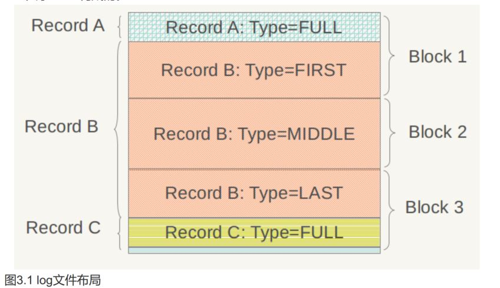
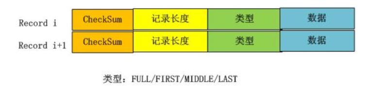
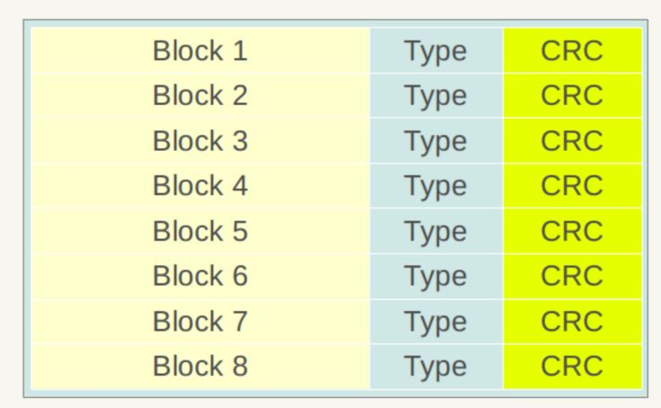
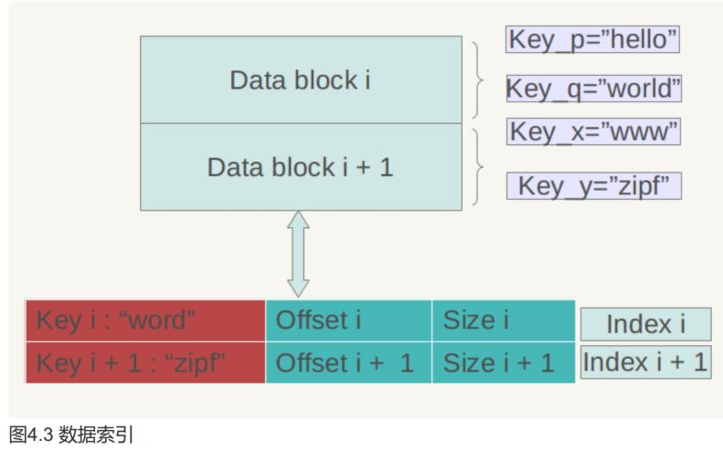
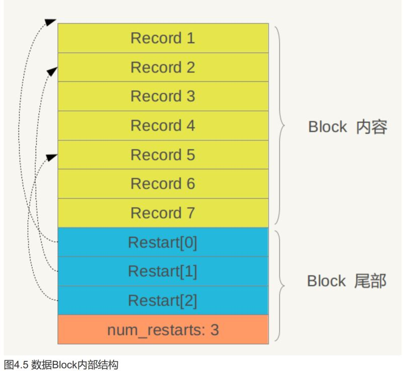
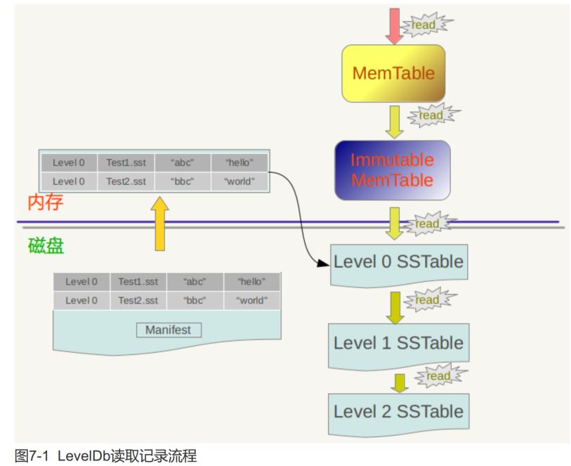
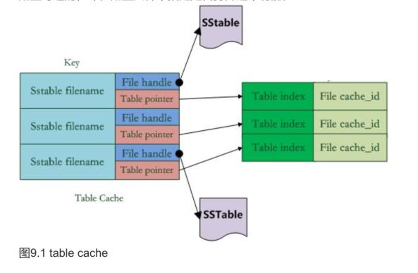
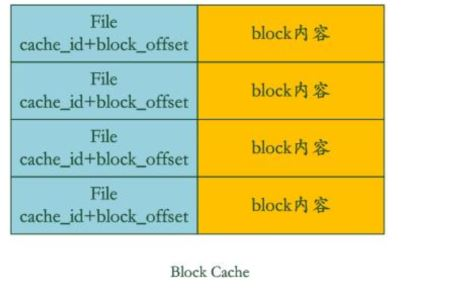

搜搜：为什么，可以看到所以有疑惑的地方

# 1. 概述

**levelDB特点**：
1. KV系统，不狂吃内存，将大部分数据存储到磁盘上
2. 根据key值，有序存储，用户可自定义比较函数，按此顺序存储
3. 接口简单。写记录、读记录、删除记录。支持多条操作的原子批量操作
4. 具有快照功能。为什么捏:快照功能可以使读取操作不受写操作影响，可以在读操作过程中始终看到一致的数据。怎么就做到了能
5. 支持数据压缩，可以增快IO效率、
6. 写操作大大快于读操作，顺序读写操作，大大快于随机读写操作。
7. 随机写 40万条/s，随机读6万条/s
8. 是单机存储库。针对大规模的KV

# 2. 整理架构
就是说需要了解：
1. LevelDB存储的数据在内存和磁盘中是如何分布的，处于什么状态
2. 如何写和如何读，即接口内的内部操作
3. 系统崩溃是如何恢复

**主题构成元素**：
1. 内存中的 Memtable、Immutable Memtable
2. 磁盘中的文件：Current文件、Manifest文件，log文件，SSTable文件

**具体存储过程**
1. 先写log，在插入内存中的MemTable，一次写操作只涉及一次磁盘写入和一次内存写入，所以速度快，也能防止崩溃是内存的的数据没有及时dump到内存中而丢失。(可以从内存中恢复)
2. 内存中的MemeTable占用到一定程度后，会导出到外村文件中，生成新的Log文件和Immutable MemTable（由memtable生成，且是只读的，无法写入和删除）
3. 导出这一过程完成后，新来的数据会记录到新的Log和Memtable，重复第1步
4. 并且LeveDB会将Immutable中的数据导到磁盘（即内存-->外村-->磁盘），形成 新的SSTable文件（所有的.sst文件称为SSTable文件，注意关系）。可称为Compaction过程
5. SSTable的所有文件是一种层级结构，level0，level1...,所以称为LevelDB（考点），文件后缀是.sst

.sst文件中数据是按Key有序的。Level0中，一个.sst文件中的数据的key，可能和另一个.sst的key重叠，但是其他的层Level L的.sst文件是不会的，后面很多操作的差异都是这个原因导致

**Manifest**：存储.sst文件的信息,如最大的Key和最小的key，属于哪个level等等

**current**：manifest文件会不断更新，current就记录当前manifest文件名，只有一行信息

# 3. log文件的结构

log文件被切割成32K单位的物理Block，每次读取的单位以一个Block作为基本的读取单位。
从物理布局来讲，一个log文件就是有连续的32K大小Block构成的。
为什么？关于切割是什么东西

在应用的视野里是看不到这些Block的，应用能看到的时候一系列的Key：Value对。在LevelDB还会对每条key:value对增加一些管理信息，如下：

1. CheckSum:为了避免处理不完或者是被迫话的数据，当LevelDB读取数据的时候会对数据进行校验。校验的是“类型”和“数据”字段
2. 记录长度
3. 数据：即Key：Value数值对
4. 类型：只出每条记录的逻辑结构和log文件物理分块结构之间的关系，有四种即FULL、FIRST、MIDDLE、LAST

如果类型为full说明这条记录完整的存储在一个物理block里，否则说明此条记录被相邻的Block切割开。
假设目前存在三条记录，Record A，Record B和Record C，其中Record A大小为10K，Record B 大小为80K，Record C大小为12K，那么其在log文件中的逻辑布局会如图3.1所示。Record A是图中蓝色区域示，因为大小为10K<32K，能够放在一个物理Block中，所以其类型为FULL；Record B 大小为80K，而Block 1因为放入了Record A，所以还剩下22K，不足以放下Record B，所以在Block 1的剩余部分放入Record B的开头一部分，类型标识为FIRST，代表了是一个记录的起始部分；Record B还有58K没有存储，这些只能依次在后续的物理Block里面，因为Block 2大小只有32K，仍然放不下Record B的剩余部分，所以Block 2全部用来放Record B，且标识类型为MIDDLE，意思是这是Record B中间一段数据；Record B剩下的部分可以完全放在Block 3中，类型标识为LAST，代表了这是Record B的末尾数据；图中黄色的Record C因为大小为12K，Block 3剩下的空间足以全部放下它，所以其类型标识为FULL。

从这个小例子可以看出逻辑记录和物理Block之间的关系，LevelDb一次物理读取为一个Block，然后根据类型情况拼接出逻辑记录，供后续流程处理。

# 4. SSTable 文件
和log文件一样都是切割成固定大小的Block的，但是.sst文件中的key由小到大有序排列，log文件key是无序的。
为什么:key值得大小，是指size？还是字母排序那种？

## 4.1. sst文件的格式
1. 数据存储区，浅黄部分
2. Type：蓝色部分，标识数据是否采用了压缩算法（Snappy压缩或者无压缩两种得空可以学习下Snappy）。
3. CRC：数据校验码，用于判断数据在生成和传输过程中是否出错。
## 4.2. sst文件逻辑解释

1. 数据存储区：Key：Value数据，绿色部分
2. 数据管理区：索引指针等，目的是更快速便捷的查找相应的记录。
   - Meta Block：浅紫色部分，LevelDB尚无实际应用，保留了接口，以后可能会用
   - Meta Block Index(索引)：红色部分
   - 数据索引（index Block）：蓝色部分
   - 文件尾块（Footer）：蓝色部分

### 4.2.1. 数据索引（block index）

首先注意：Data Block内的KV记录是有序的
数据索引区（index block ）的每条数据是对某个Data Block建立的索引信息，每条索引信息包含三个内容：
- 红色部分：是大于等于数据块i中最大的Key值的那个Key
- Offset i:数据块i在.sst文件中的起始位置
- Size i:Data Block i的大小（有时候是有数据压缩的)

### 4.2.2. Footer

- metaindex_handle指出了metaindex block的起(索引的索引)
始位置和大小；
- inex_handle指出了index Block的起始地址和大小（索引的索引）
- 后面跟着一个填充区和魔数

### 4.2.3. 数据存储区

图中可分为两部分：Block内容和Block尾部
block内容里的KV是有序的，Block里key值还可以通过不存重叠的部分减少存储量,比如key i=“the Car”，Keyi+1=“the color”,那么两者存在重叠部分“the c”，为了减少Key的存储量，Key i+1可以只存储和上一条Key不同的部分“olor”，两者的共同部分从Key i中可以获得

尾部是记录重启点的。所谓重启点：在这条记录开始，不再采取只记载不同的Key部分，而是重新记录所有的Key值，假设Key i+1是一个重启点，那么Key里面会完整存储“the color”，而不是采用简略的“olor”方式

**Block内容格式**：

# 5. MemTable
文档上说：总体而言，所有KV数据都是存储在Memtable。为什么？不对吧，Memtable的数据一定程度会导出到外存中，怎么会是全部能，只能是最新的吧？

LevelDb的Memtable中KV对是根据Key大小有序存储的，在系统插入新的KV时，LevelDb要把这个KV插到合适的位置上以保持这种Key有序性

数据结构SkipList

LevelDB的Memtable类是一个接口类,但真正的操作有背后的SkipList（是个数据结构）

SkipList是平衡树的一种替代数据结构，但是和红黑树不相同的是,SkipList对于树的平衡的实现是基于一种随机化的算法的，也就是锁SkipList的插入和删除的工作是比较简单的。为什么？这里是知识盲区 。SkipList不仅是维护有序数据的一个简单实现，而且相比较平衡树来说，在插入数据的时候可以避免频繁的树节点调整操作，所以写入效率是很高的，LevelDb整体而言是个高写入系统，SkipList在其中应该也起到了很重要的作用。Redis为了加快插入操作，也使用了SkipList来作为内部实现数据结构。

# 6. 写入与删除记录

## 6.1. 写入过程
1. 先磁盘上log文件追加，磁盘文件顺序追加非常快
2. log写入成功后，会将KV插入内存中memtable中
   - memtable只是一层封装，真正的操作有数据结构Skiplist执行
   - 先查和是的插入位置，然后修改相应的链接指针将新KV插入即可
  
因为一次写入仅涉及到磁盘文件追加和内存Skiplist插入操作，所以LevelDB写入非常高效。

## 6.2. 删除过程
删除操作等同于写入操作，不同的是插入的是“Key:删除标记”，而不是真正的删除，是Lazy的，等后台Compaction时才会真正的做删除操作

# 7. 读取操作

更新（修改）KV，直接覆盖就好

读取过程：
一层层往下查找。Memtabale-->Immutable MemTable-->SSTable
因为依照新鲜程度去读，所以是这个顺序

读操作更复杂。在读level0上的.sst文件时还不一样，因为这部分的Key是有重叠的，具体的方法是：LevelDb的策略是先找出level 0中哪些文件包含这个key（manifest文件中记载了level和对应的文件及文件里key的范围信息，LevelDb在内存中保留这种映射表）， 之后按照文件的新鲜程度排序，新的文件排在前面，之后依次查找，读出key对应的value

尽量避免大规模的随机读操作,顺序读会很快，但是读的速度远远慢与写的速度，读的逻辑比较复杂
# 8. Compaction
整理、压缩已有的记录，删除无效的（带删除标签的）KV数据，减小规模、文件数量等。

三种类型：minor和major，LevelDB只有这两中，Bigtable还有个full

- minor Compaction： 就是把Memtable中的数据导出到SSTable中。注意：具体的过程是内存中Memtable满了是导入到外存即Immutable Memtable中，然后到SSTable
- major Compaction：合并不同层级的SSTable文件
- full Compaction：将所有的SSTable文件进行合并
为什么？“合并不同层级的SSTable文件”和“将所有的SSTable文件进行合并”有区别吗？
## 8.1. minor compaction

按照immutable memtable中记录由小到大遍历，并依次写入一个level0 的新建SSTable文件中，写完后建立文件的index 数据，这样就完成了一次minorcompaction
minor compaction的时候并不做删除，在以后更高层级的compaction中会去做
## major Compaction
major Compaction：当level下的.sst文件超过一定设置后，evelDb会从这个level的SSTable中选择一个文件（level>0），将其和高一层级的level+1的SSTable文件合并

minor compaction和major Compaction是一整套过程，要搞清楚。简单来讲，level0层级的.sst文件是minor Compaction生成的，其他层级的.sst文件是major Compaction生成的。一般来说Compaction是选择某个层级的上的一个.sst文件晋升为更高一级的.sst文件，但是对于major Compaction，因为LeveL0层上的.sst文件的Key可能有重叠，所以可能有多个文件参与major Compaction

Compaction选文件的顺序就是轮流，一个接着一个，这样每个.sst文件都有机会轮流和高层的level文件进行合并

过程：
1. 对多个文件采用多路归并排序，依次找出其中最小的Key记录
2. 排序完之后按照一定的标准判断这个Key是否需要保存
3. 需要保存的Key写入LevelL+1层中新生成的一个SSTable文件中
4. 删除之前参与过Compaction L层文件和L+1层的文件

**判断KV记录是否抛弃的标准**：
对于某个Key，如果在小于L层中的SSTable文件中存在这个Key，则抛弃。因为在更低的层级中如果存在同一个Key的记录，说明这个可以，有更新鲜的Value存在。
# 9. Cache
之所以会有这一步，因为在read的时候，memtable中没找到，得去SSTable文件中找。这就需要Cache了
假设最好能在Level0层中就找到这个Key，也需要读取两次磁盘：1. 将SSTable的文件中的index(为什么？指的是是指.sst文件的block index吗？)部分读入内存，这样就可以确定key在哪个block中存储  。2. 读入这个block内容，然后再内存中查找key对应的value

Cache分两种：Table Cache和B类Block Cache。Block Cache是配置可选的，可在配置文件中打开或者关闭

Table Cache

1. key:.sst(SSTable)文件名字，
2. value：包含两部分
   - File handle:打开.sst文件的指针
   - Table Pointer：数据结构指针，包含：1. .sst文件的Index内容。 2.用来指示block Cache用的cache_id。

比如一次get（key）过程：
1. 如果LevelDb确定了Key在level下某个文件A的key range范围。
2. 首先判断文件A是否真的包含这个KV
3. 包含的话就会首先查找Table Cache，看文件A是否在缓存里
4. 如果缓存里找的了，那么就会根据index部分查找是哪个block包含这个key。
5. 找到了key所属的block，就会读入block内容，这是第二次读取 

Block Cache就是为了加快这个过程的。
1. key：文件的cache_id加上block在这个文件的起始位置block_offset。
2. value：block的内容
   
如果所需的block的内容在cache里存在，则可以直接在cache查找key的Value，如果没找到，则需要先将block内容插入到block cache中。levelDb就是这样用过两个cache加快读取速度的
# 10. version

Version、VersionEdit、VersionSet

**version**:n 保存了当前磁盘以及内存中所有的文件信息，一般只有一个Version叫做"current" version（当前版本）。Leveldb还保存了一系列的历史版本。
当一个Iterator创建后，Iterator就引用到了current version(当前版本)，只要这个Iterator不被delete那么被Iterator引用的版本就会一直存活。这就意味着当你用完一个Iterator后，需要及时删除它。
 当一次Compaction结束后（会生成新的文件，合并前的文件需要删除），Leveldb会创建一个新的版本作为当前版本，原先的当前版本就会变为历史版本。

 **VersionSet** 是所有Version的集合，管理着所有存活的Version
 **VersionEdit** 表示Version之间的变化，相当于delta 增量，表示有增加了多少文件，删除了文件。下图表示他们之间的关系：`Version0 +VersionEdit­­>Version1`
 VersionEdit会保存到MANIFEST文件中，当做数据恢复时就会从MANIFEST文件中读出来重建数据。

 比如我们的服务器上有一个字典库，每天我们需要更新这个字典库，我们可以新开一个buffer，将新的字典库加载到这个新buffer中，等到加载完毕，将字典的指针指向新的字典库。
 leveldb的version管理和双buffer切换类似，但是如果原version被某个iterator引用，那么这个version会一直保持，直到没有被任何一个iterator引用，此时就可以删除这个version。